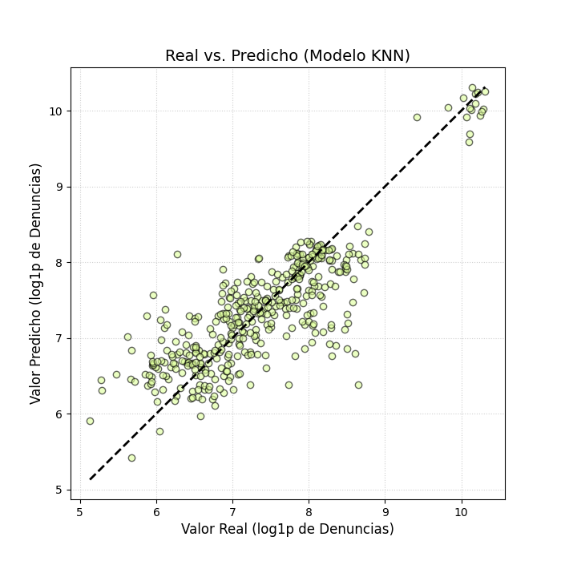

# Modelo de Regresión: Ejecución Presupuestal PP0030 vs Denuncias Policiales

## 📋 Descripción del Proyecto

Este proyecto desarrolla un **modelo de regresión** para analizar la influencia de la **Ejecución Presupuestal del Programa Presupuestal PP0030** sobre la **Tasa de Denuncias Policiales** en Perú.

### Objetivo
Determinar si existe una relación estadísticamente significativa entre:
- **Variable predictora:** Monto devengado del presupuesto PP0030 (por departamento y mes)
- **Variable objetivo:** Cantidad de denuncias policiales (por departamento y mes)


## 📊 Datasets

### 1. Denuncias Policiales (2018-2025)
- **Archivo:** `data/raw/DATASET_Denuncias_Policiales_Enero 2018 a Agosto 2025.csv`
- **Granularidad:** Mensual por departamento
- **Columnas clave:** ANIO, MES, DPTO_HECHO_NEW, cantidad

### 2. Ejecución Presupuestal PP0030 (2019-2025)
- **Archivo:** `data/raw/DATASET_Ejecu_Presup_PP0030_Ene 2019 a Ago 2025.csv`
- **Granularidad:** Mensual por departamento
- **Columnas clave:** ANO_EJE, MES_EJE, DEPTO_EJEC_NOMBRE_NEW, MONTO_DEVENGADO


## 🚀 Inicio Rápido

### 1. Configurar Entorno Virtual

# Crear entorno virtual con Python 3.11
py -3.11 -m venv .venv

# Activar (Windows)
.venv\Scripts\activate

# Instalar dependencias
pip install -r requirements.txt

### 2. Ejecutar proyecto

python notebooks/main.py

## 📁 Estructura del Proyecto

```
RegressionPoliceReports-PP0030/
│
├── data/
│   ├── raw/                          # Datos originales (no modificar)
│   │   ├── DATASET_Denuncias_Policiales_Enero 2018 a Agosto 2025.csv
│   │   └── DATASET_Ejecu_Presup_PP0030_Ene 2019 a Ago 2025.csv
│   │
│   └── processed/                    # Datos limpios (generados automáticamente)
│       ├── denuncias_clean.csv
│       └── ejecucion_clean.csv
│
├── models/
│   └── ridge_baseline.joblib        # Modelo entrenado (generado automáticamente)
|
├── notebooks/
|   ├── main.py    # Pipeline principal
│   └── ...        # Módulos auxiliares
│
├── screenshots/                     # Capturas de pantalla de los gráficos resultantes
│
├── requirements.txt                  # Dependencias Python (pip)
└── README.md                         # Este archivo
```

## 🤖 Modelado

### Features Creados
- **Lags temporales:** MONTO_LAG_1, MONTO_LAG_2, MONTO_LAG_3 (montos devengados en meses anteriores)
- **Features temporales:** month (mes del año), year (año)
- **y (target):** Logaritmo + 1 de cantidad de denuncias, con el fin de estabilizar la varianza

### Modelo Baseline
- **Algoritmo:** Ridge Regression con validación cruzada (RidgeCV)
- **Preprocesamiento:** StandardScaler (normalización de features)
- **Validación:** Split temporal (últimos 6 meses como test set)
- **Métricas:** RMSE, MAE, R²
 
## 🔧 Tareas realizadas
- Integración de datasets de denuncias policiales y ejecución presupuestal PP0030 (2019–2025).
- Limpieza y normalización de datos, eliminación de outliers, alineación temporal y creación de rezagos (lags).
- Entrenamiento y validación con 10-fold cross-validation.
- Comparación de cinco modelos de regresión: Ridge, Lasso, ElasticNet, KNN y Decision Tree.

## 📈 Resultados

### Comparación de modelos

| Modelo       | MSE (Mean) | MAE (Mean) | R² (Mean) |
|--------------|------------|------------|-----------|
| **KNN**      | 0.2755     | 0.3963     | 0.6863    |
| DecisionTree | 0.3846     | 0.4591     | 0.5582    |
| ElasticNet   | 0.5037     | 0.5762     | 0.4260    |
| Ridge        | 0.5055     | 0.5701     | 0.4245    |
| Lasso        | 0.5107     | 0.5830     | 0.4182    |


- El modelo **K-Nearest Neighbors (KNN)** obtuvo el mejor desempeño:
  - MSE = 0.2755  
  - MAE = 0.3963  
  - R² ≈ 0.69
- Se identificó una relación **no lineal** entre ejecución presupuestal y denuncias.
- Factores de tendencia y estacionalidad (año y mes) también influyen en la variación del delito.

### Gráfica Real vs Predicción (KNN)


Se observa una proporción relativamente lineal entre lo predicho y lo obtenido, para el log1p de número de denuncias. Sin embargo, una cantidad considerable de valores se alejan de la diagonal. Esto corresponde con el valor de R^2, de 0.6863, el cual indica una capacidad predictiva razonable, mas no perfecta.


## ✅ Conclusión
El objetivo de analizar la influencia del PP0030 sobre la tasa de denuncias se cumplió.  
La hipótesis de una relación lineal fue **parcialmente refutada**: el vínculo es más complejo y depende de patrones históricos y contextuales. 
Los modelos lineales evaluados (Lasso, Ridge y ElasticNet) no evidenciaron una relación proporcional clara, indicando que el vínculo entre presupuesto y denuncias no responde a una dinámica lineal.
El modelo KNN demostró ser adecuado, aunque se recomienda incorporar variables socioeconómicas y algoritmos más complejos en futuros trabajos.

## 📈 Próximos Pasos

- [ ] **EDA completo:** Visualizaciones de series temporales, correlaciones, estacionalidad
- [ ] **Modelos adicionales:** Lasso, RandomForest, XGBoost
- [ ] **Validación temporal:** TimeSeriesSplit, walk-forward validation
- [ ] **Pruebas de causalidad:** Granger causality test
- [ ] **Análisis de residuales:** ACF/PACF, pruebas de estacionariedad (ADF)
- [ ] **Notebook interactivo:** Jupyter notebook con visualizaciones y explicaciones
- [ ] **Documentación final:** Reporte ejecutivo con hallazgos y recomendaciones

---

## 👥 Equipo

Este proyecto es desarrollado como parte de un trabajo de análisis del curso Inteligencia Artificial (1INF24).

- ARAGON VILCA, RODRIGO RAYHAN JEREMY
- LUYO DAGA, MIGUEL ANGEL
- RAYMUNDO MOREYRA, PIERO EDUARDO
- RODRIGUEZ ALMORA, AMIRA PAOLA
- YABAR REAÑO, SANTIAGO

## 📝 Notas

- **Relación causal vs correlación:** Este modelo identifica asociaciones estadísticas, no necesariamente causalidad directa.
- **Datos limpios reutilizables:** Los CSVs procesados en `data/processed/` pueden usarse para otros análisis sin reprocesar.
- **Modelo versionable:** El archivo `.joblib` permite versionar y comparar diferentes iteraciones del modelo.


**Última actualización principal:** Noviembre 2025
